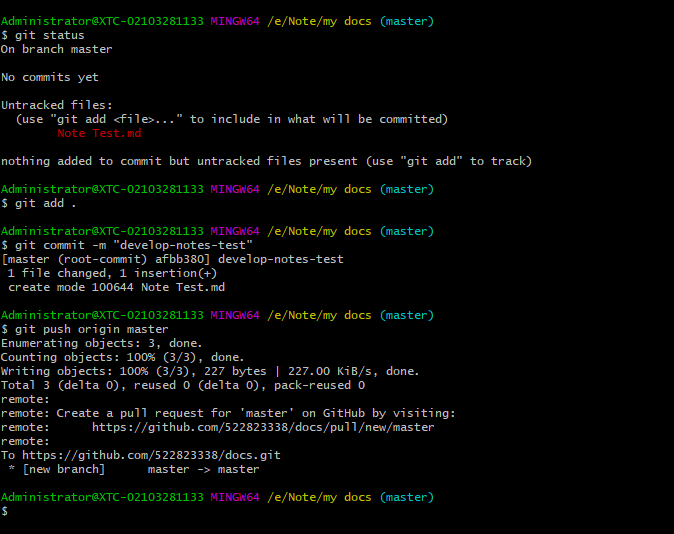

**如何将本地笔记保存至github**

1，Git下载

    要能正常使用GitHub，需要先下载Git
    Git官网地址：Git
    Git一般是用命令行来操作，也可下载Git的可视化软件，例如：tortoise（小乌龟）

2，创建GitHub仓库项目

点击“repositories”，随后点击“New”
在这里插入图片描述
填入自己的项目名，此处以“develop-notes”为例，也可以选择公开或者是私有
在这里插入图片描述
3，在本地创建同名文件夹

右键文件夹，如果之前已成功安装了Git，那么右键后会出现Git的相关选项，选择“Git Bash Here”，输入以下命令，“------”后是解释说明，

git status  ------查看当前状态

因为还没有对该文件夹进行初始化，所以输入该命令会提示

fatal: not a git repository (or any of the parent directories): .git

随后输入

git init	------初始化当前文件夹

该文件夹已经一个git类型的文件夹了
4，将本地文件与GitHub项目关联

输入

git remote add origin https://github.com/zhhelloDream8080/develop-notes.git

origin ------项目主机名，以后提交项目时提交到该主机下
https://XXXXXXXX ------项目的URL，可以在GitHub创建好的项目中找到

查看主机名：git remote，会显示origin，当然主机名是自己定的，也可以是其它
5，上传文件到GitHub

先在自己的文件夹下新建一个记事本，或者将自己需要上传的文件放入文件夹下，因为文件夹如果为空是不能被push的
随后就是上传操作了

    git status
    git add .
    git commit -m “develop-notes-test”
    git push origin master

如果一切顺利，那在GitHub中就可以看到上传的文件了，如果没有，可以参照下面的错误总结。

